# Evidencia 02: Documento de Diseño del Sistema (SDD)
## Software Design Document — **Style-Nails / Aleja-Nails**

---

### Portada Institucional

| Información Académica y del Proyecto |
|---|
| **Programa de Formación:** Tecnólogo en Análisis y Desarrollo de Software (ADSO) |
| **Ficha:** 3230026 |
| **Centro de Formación:** Centro de Formación Agroindustrial – Regional Huila |
| **Institución:** Servicio Nacional de Aprendizaje (SENA) |
| **Presentado Por:** Nicolle Suache Vanegas |
| **Presentado a:** Celia Andrea Saab Cano (Instructora) |
| **Fecha:** Marzo de 2026 |

---

## Tabla de Contenido

1. [Diagramas de Secuencia](#1-diagramas-de-secuencia)
   - 1.1 [Inicio de Sesión](#11-inicio-de-sesión)
   - 1.2 [Registro de Cliente](#12-registro-de-cliente)
   - 1.3 [Gestión de Servicios](#13-gestión-de-servicios)
   - 1.4 [Agendamiento de Citas (Reservas)](#14-agendamiento-de-citas-reservas)
2. [Diagrama de Paquetes](#2-diagrama-de-paquetes)
3. [Diagrama de Despliegue](#3-diagrama-de-despliegue)
4. [Diagrama de Componentes](#4-diagrama-de-componentes)
5. [Diagrama de Clases (UML)](#5-diagrama-de-clases)
6. [Diagrama de Casos de Uso](#6-diagrama-de-casos-de-uso)
7. [Diagramas de Actividades](#7-diagramas-de-actividades)
   - 7.1 [Actividad: Inicio de Sesión](#71-actividad-inicio-de-sesión)
   - 7.2 [Actividad: Registro](#72-actividad-registro)
   - 7.3 [Actividad: Gestión de Servicios](#73-actividad-gestión-de-servicios)
   - 7.4 [Actividad: Agendar Cita](#74-actividad-agendar-cita)
8. [Diagrama Entidad-Relación (DER)](#8-diagrama-entidad-relación-der)

---

## 1. Diagramas de Secuencia

### 1.1 Inicio de Sesión
Representa el flujo de autenticación del usuario (cliente o administrador) desde la interfaz visual hasta la base de datos con verificación de hash criptográfico.

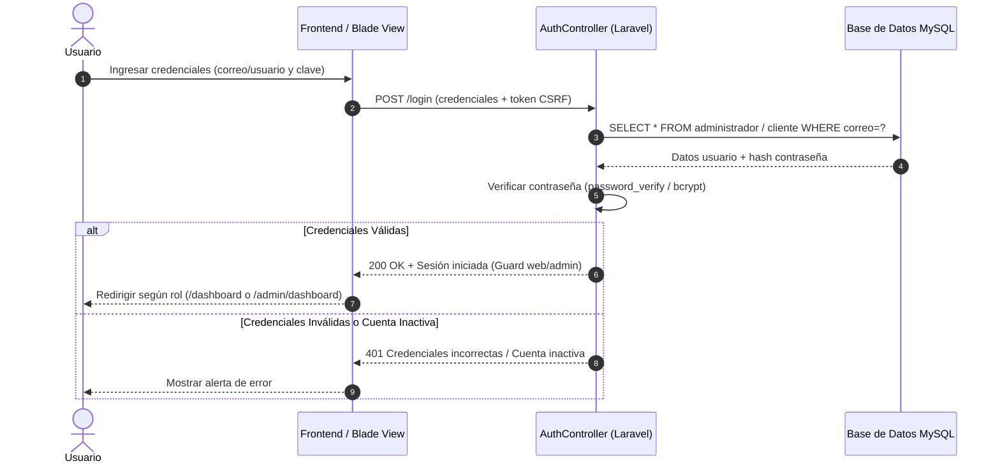

---

### 1.2 Registro de Cliente
Representa el proceso mediante el cual un visitante crea una nueva cuenta en la plataforma.

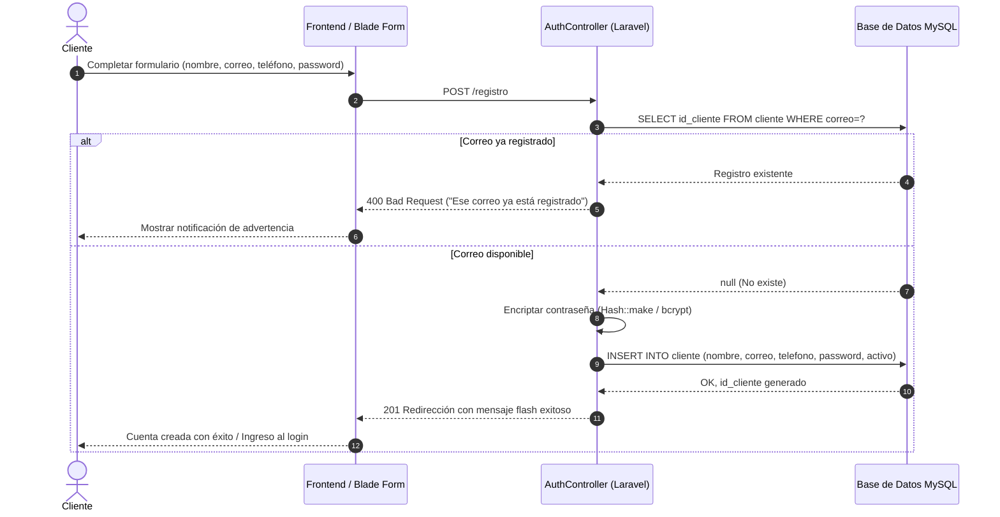

---

### 1.3 Gestión de Servicios
Muestra las operaciones que realiza el Administrador sobre el catálogo de servicios (creación, edición, borrado).

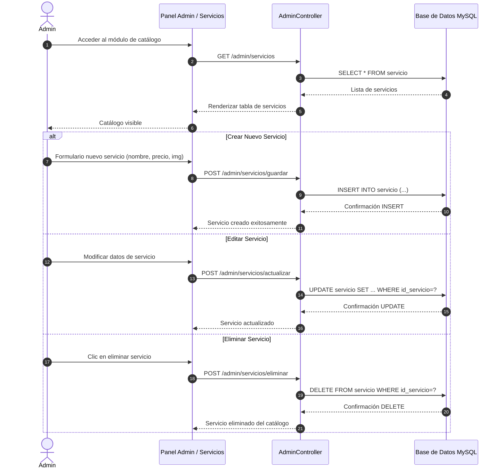

---

### 1.4 Agendamiento de Citas (Reservas)
Muestra el flujo de selección de servicio, consulta asíncrona de disponibilidad, persistencia de reserva y confirmación.

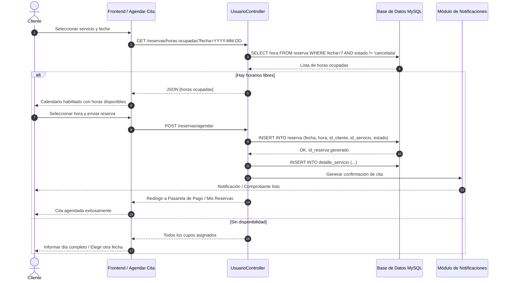

---

## 2. Diagrama de Paquetes

Organización modular del sistema bajo la arquitectura en capas del framework Laravel (Modelo-Vista-Controlador):

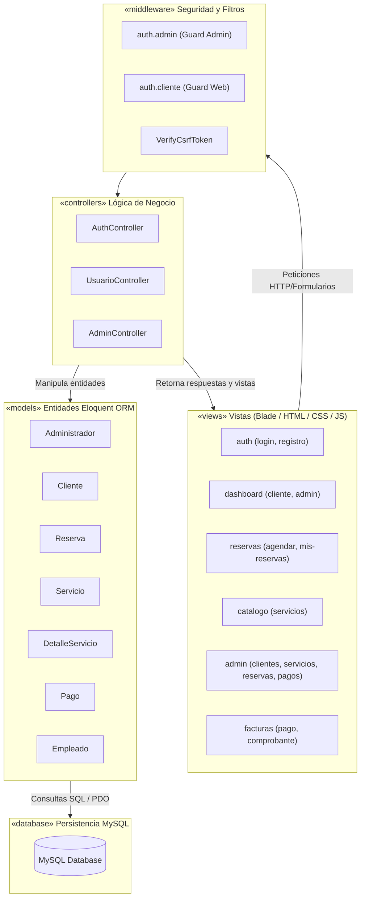

---

## 3. Diagrama de Despliegue

Topología física y lógica de la infraestructura de ejecución del sistema:

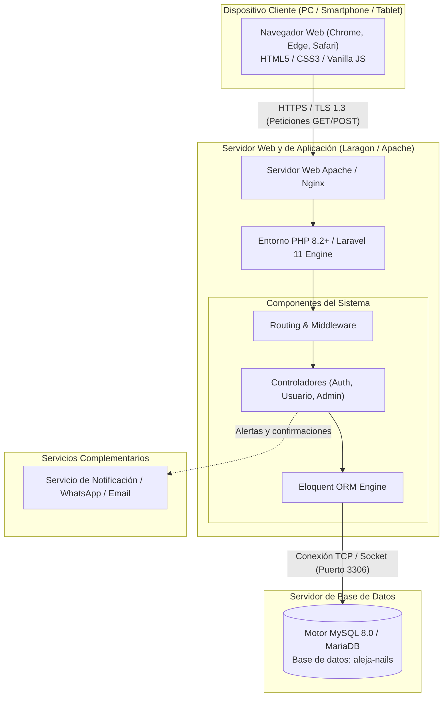

---

## 4. Diagrama de Componentes

Muestra la organización e interdependencia de los módulos de software:

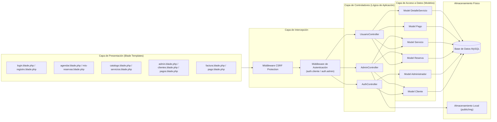

---

## 5. Diagrama de Clases (UML)

Modelo estático de datos con atributos, tipos y relaciones estructurales:

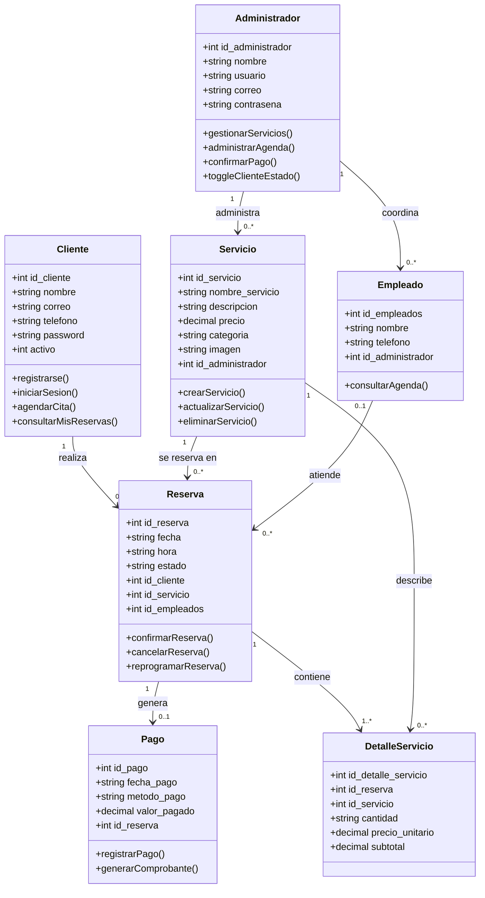

---

## 6. Diagrama de Casos de Uso

```mermaid
flowchart TD
    subgraph Actores
        ClienteAct["👤 Cliente"]
        AdminAct["👤 Administrador"]
        EmpleadoAct["👤 Empleado / Estilista"]
    end

    subgraph Sistema ["Sistema de Gestión Style-Nails"]
        CU_Reg["Registrarse en el sistema"]
        CU_Login["Iniciar sesión"]
        CU_Guardar["Guardar datos de usuario"]
        CU_ValCred["Validar credenciales"]
        CU_Cat["Consultar catálogo de servicios"]
        CU_Buscar["Buscar / Filtrar servicios"]
        CU_Res["Reservar cita"]
        CU_ValDisp["Verificar disponibilidad de horarios"]
        CU_Canc["Cancelar cita"]
        CU_MisCitas["Consultar mis reservas"]
        CU_Pago["Registrar pago / Descargar factura"]

        CU_Prog["Programar / Reprogramar citas"]
        CU_GestServ["Gestionar catálogo de servicios (CRUD)"]
        CU_GestEmp["Gestionar empleados"]
        CU_GestCli["Activar / Desactivar clientes"]
        CU_Rep["Generar reportes y arqueo de pagos"]
        CU_AgendaEmp["Consultar agenda de citas asignadas"]
    end

    ClienteAct --> CU_Reg
    ClienteAct --> CU_Login
    ClienteAct --> CU_Cat
    ClienteAct --> CU_Buscar
    ClienteAct --> CU_Res
    ClienteAct --> CU_Canc
    ClienteAct --> CU_MisCitas
    ClienteAct --> CU_Pago

    AdminAct --> CU_Login
    AdminAct --> CU_Prog
    AdminAct --> CU_GestServ
    AdminAct --> CU_GestEmp
    AdminAct --> CU_GestCli
    AdminAct --> CU_Rep
    AdminAct --> CU_Cat

    EmpleadoAct --> CU_Login
    EmpleadoAct --> CU_AgendaEmp

    CU_Reg -. "«include»" .-> CU_Guardar
    CU_Login -. "«include»" .-> CU_ValCred
    CU_Res -. "«include»" .-> CU_ValDisp
```

---

## 7. Diagramas de Actividades

### 7.1 Actividad: Inicio de Sesión

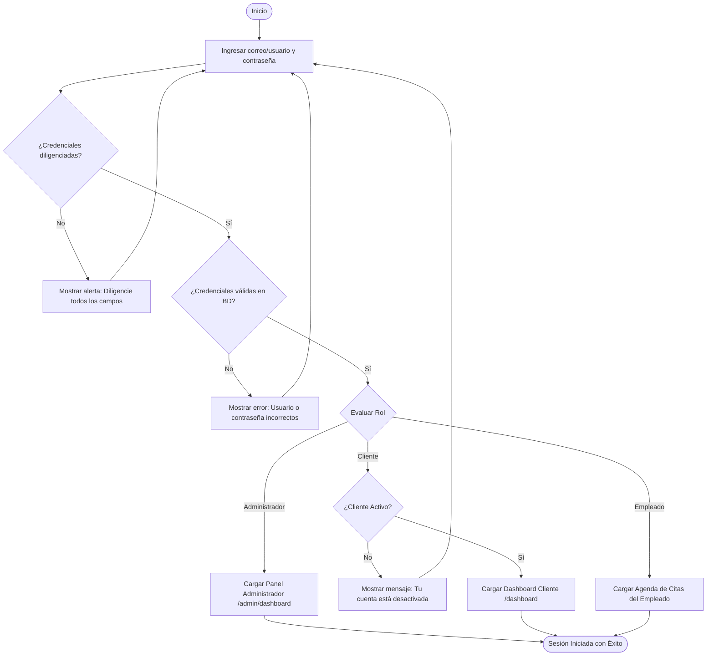

---

### 7.2 Actividad: Registro

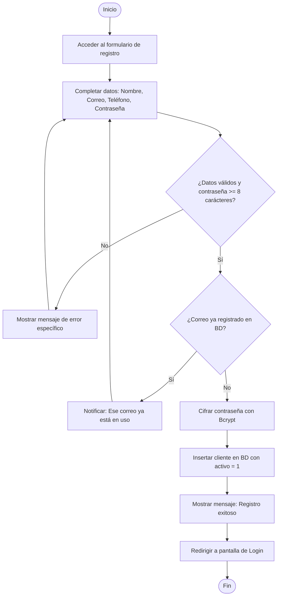

---

### 7.3 Actividad: Gestión de Servicios

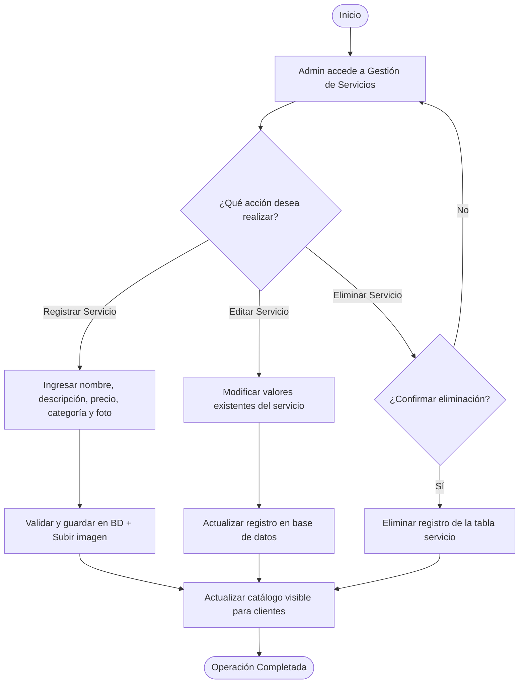

---

### 7.4 Actividad: Agendar Cita

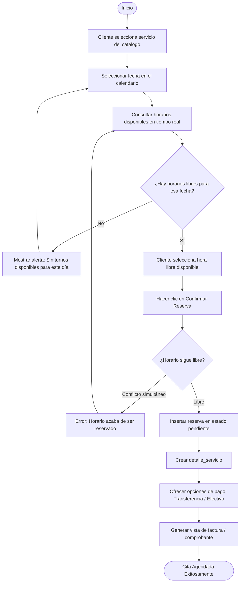

---

## 8. Diagrama Entidad-Relación (DER)

Representación del esquema relacional implementado en la base de datos MySQL `aleja-nails`:

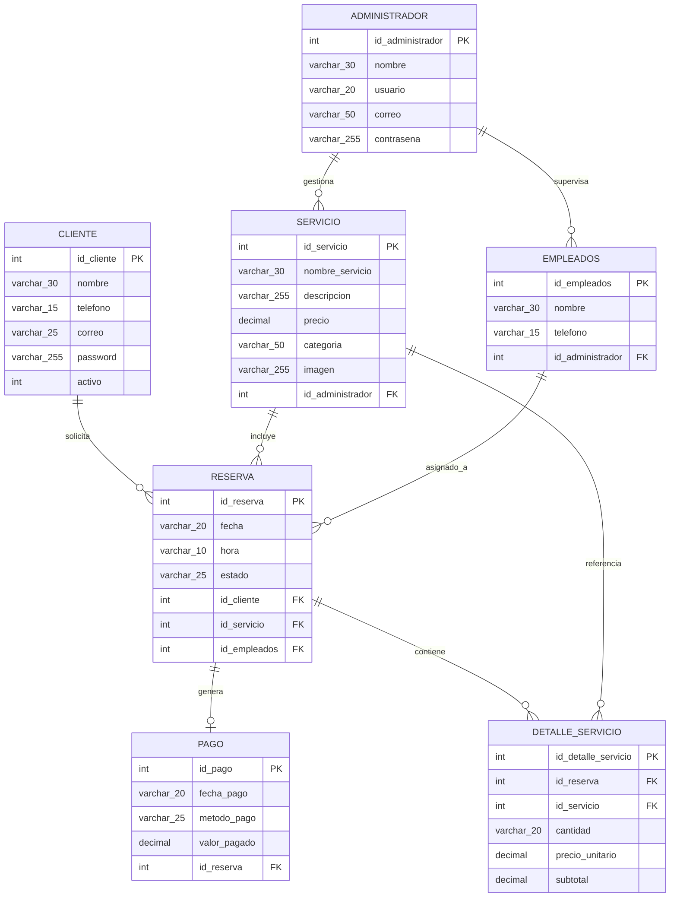
